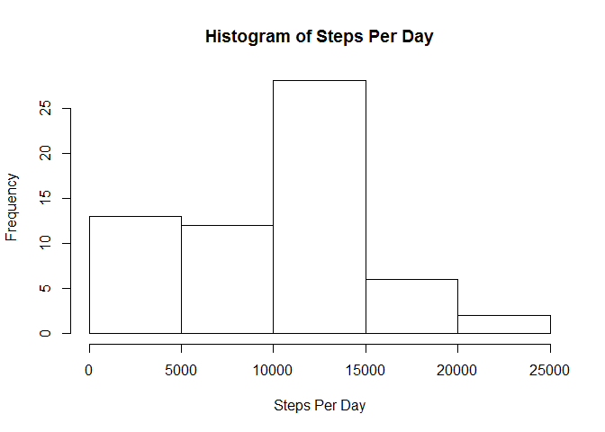
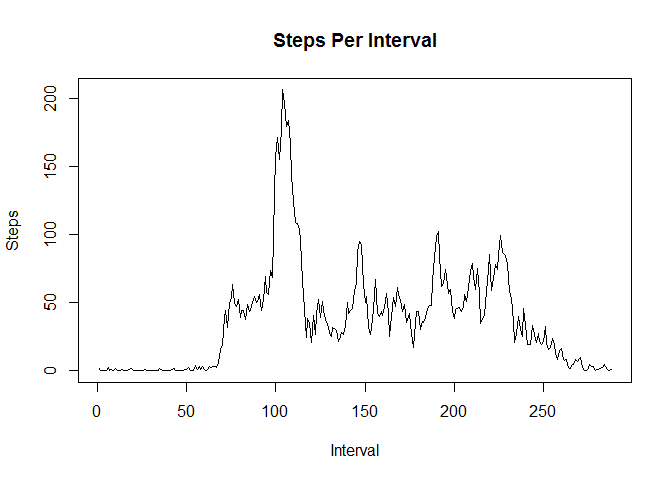
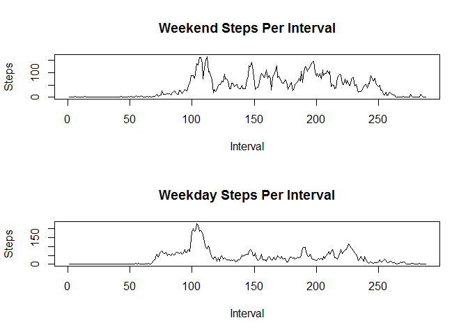

# Reproducible Research: Peer Assessment 1


## Loading and preprocessing the data

```r
unzip("activity.zip")
activity <- read.csv("activity.csv")
library(lubridate)
activity$processedday <- wday(ymd(activity$date),label=TRUE)
```


## What is mean total number of steps taken per day?


```r
StepsPerDay <- tapply(activity$steps,activity$date,sum,na.rm=TRUE)
hist(StepsPerDay,main="Histogram of Steps Per Day",xlab="Steps Per Day")
```

 

The mean total number of steps taken per day is 9354.2295082 and the median is 10395

## What is the average daily activity pattern?

```r
StepsPerInterval <-tapply(activity$steps,activity$interval,mean,na.rm=TRUE)
plot(StepsPerInterval,type="l",main="Steps Per Interval",xlab="Interval",ylab="Steps")
```

 


The 5 minute interval with the maximum number of steps on average is 104


## Imputing missing values

Here we impute missing values by filling with average for the interval the missing value is in.


```r
activity[is.na(activity$steps),'steps'] <- sapply(activity[is.na(activity$steps),'interval'],function (x) { StepsPerInterval[as.character(x)]})
```


## Are there differences in activity patterns between weekdays and weekends?


```r
par(mfrow=c(2,1))

weekendactivity <- activity[activity$processedday=='Sat' | activity$processedday=='Sun',]
weekdayactivity <- activity[activity$processedday!='Sat' & activity$processedday!='Sun',]
weekendStepsPerInterval <- tapply(weekendactivity$steps,weekendactivity$interval,mean)
weekdayStepsPerInterval <- tapply(weekdayactivity$steps,weekdayactivity$interval,mean)
plot(weekendStepsPerInterval,type='l',main="Weekend Steps Per Interval",xlab="Interval", ylab="Steps")
plot(weekdayStepsPerInterval,type='l',main="Weekday Steps Per Interval",ylab="Steps",xlab="Interval")
```

 
